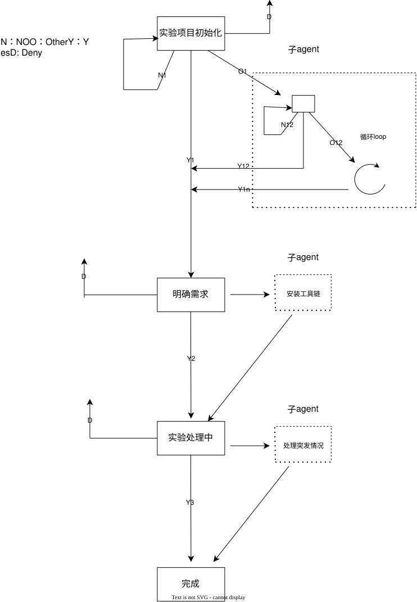

# OpenLab Skill

[English](README.md)

OpenLab Skill 是一个开放的 Agent 实验与课程报告书写技能，灵感来自用 Agent 全程完成实验报告交付的实践。它旨在提升效率，把真正重要的时间留给对实验过程的观察和对实验结果的思考。

OpenLab Skill 是一个通用型 Skill。它抽象出一般实验的基础过程，可作为后续提炼自己工作流 Skill 的简易框架。其原理是：一条单一、自包含的四阶段主链（初始化 → 明确需求 → 处理中 → 完成），主 Agent 从不假设用户意图，每一格都等待用户选择「继续」「返回」「其他」或「结束」。除这四个明确选项以外的任何输入都归为「其他」，交由一个最多两轮的自由输入子 Agent 处理；工具链安装与实验中的突发情况则封装为「跑到成功为止」的子 Agent；在任意阶段选「结束」即退出本技能。示意图如下：

## 范围与安全边界

> **建议**：使用本 Skill 之前，先备份一份实验文件夹。虽然 Skill 在流程中限制了实验过程对原始输入数据的干涉能力，但为了实验安全，仍建议先备份，在备份文件夹中完成整个流程，并保留原实验文件夹。

**重要**：它明确禁止虚构测量值、截图、参考文献、软件输出或核验结论，不对使用者产生的任何成果负责。

本 Skill 协助执行、证据保存、复现、分析和文档撰写，但不对科学有效性作权威认证，不替代合格的专业审核，不绕过软件许可，也不能让未实际完成的工作变得合规。在 skill 中可能会用到视觉模型（例如理解图片输入），也会用到一些自动操作（例如 Codex 支持的 Computer Use 等），请确认实验环境的安全性，防止隐私信息泄露。

## 许可证

项目采用 [MIT License](LICENSE)。第三方软件、模板、数据集和服务等均保留各自许可证，默认不会随本项目打包。
